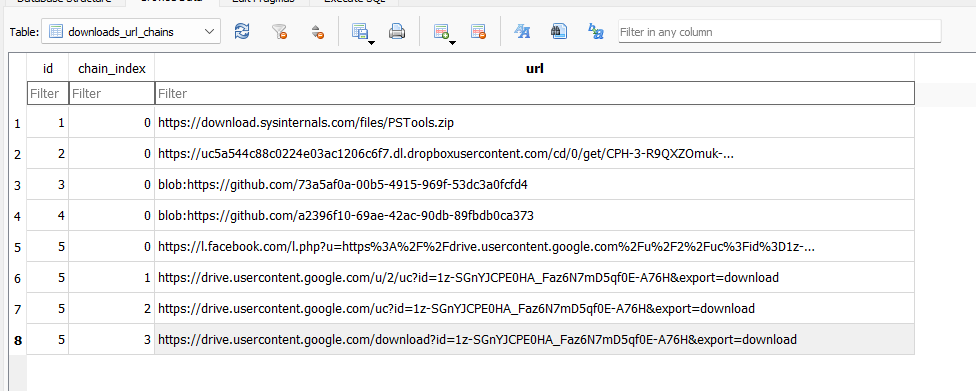
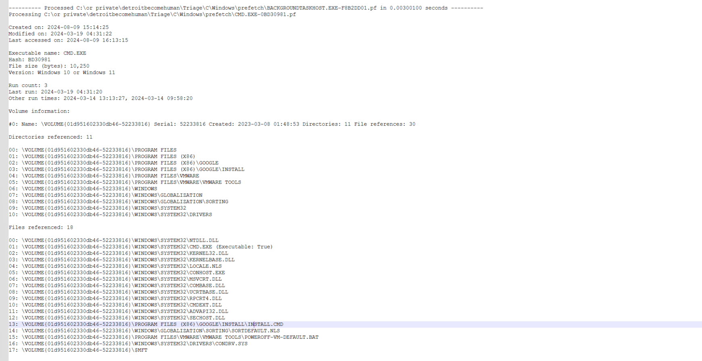

# Detroit becomes Human- hard

# Detroit becomes Human- hard

### **Sherlock Scenario**

**Alonzo Spire is fascinated by AI after noticing the recent uptick in usage of AI tools to help aid in daily tasks. He came across a sponsored post on social media about an AI tool by Google. The post had a massive reach, and the Page which posted had 200k + followers. Without any second thought, he downloaded the tool provided via the Post. But after installing it he could not find the tool on his system which raised his suspicions. A DFIR analyst was notified of a possible incident on Forela's sysadmin machine. You are tasked to help the analyst in analysis to find the true source of this odd incident.**

resources- disk image -triage
Key Info:

OS: Windows
Browser: Microsoft Edge
Start Time: 2024-03-19 04:30:00 UTC

Objectives:
Determine the malicious link Alonzo visited.
Identify the file downloaded.
Understand what happened after the file was downloaded and whether more payloads were involved.
Discover what was deleted.

Tools:
SQLite Browser
Event Viewer
PECmd
RegRipper
Autopsy
MFTECmd
HxD
Registry Explorer
PowerShell Logs
Joe Sandbox
Executive Summary
In this investigation, we analyzed the Windows system of Alonzo Spire, who was tricked into downloading malware disguised as an AI tool from a social media post. Our analysis revealed key artifacts and detailed the infection chain, including how the malware executed and persisted.

### **Executive Summary**

In this DFIR investigation, we examined the compromised Windows system of Alonzo Spire, who unknowingly installed malware disguised as an AI assistant tool from a social media post. Our analysis focused on uncovering the infection chain, identifying key artifacts, and determining how the malware executed and persisted on the system.

### **Key Findings:**

1. **Initial Infection Source**:
    - Alonzo visited a malicious Facebook post on **2024-03-19 04:30:00** UTC, leading him to download an archive from Google Drive (`AI.Gemini Ultra For PC V1.0.1.rar`).
2. **Malware Installation**:
    - The malware was installed on **2024-03-19 04:31:33** with the version **3.32.3**, masquerading as a legitimate AI tool.
3. **Staging Directory**:
    - The malware was staged in `C:\Program Files (x86)\Google`, leveraging legitimate-looking directories for persistence.
4. **Execution of Malicious Commands**:
    - A PowerShell script (`ru.ps1`) was executed from a command (`install.cmd`) to initiate the malware’s activity, bypassing security policies.
5. **Exfiltration Mechanism**:
    - A small `content.js` file was found in the malware staging directory, containing code likely used for exfiltration via browser extensions or scripts.
6. **User Actions**:
    - Upon failing to find the AI tool, Alonzo searched for it on **2024-03-19 04:32:11**. Realizing the potential compromise, he deleted the file at **2024-03-19 04:34:16**.
7. **Malware Identification**:
    - The MD5 hash of the malicious installer was identified as **BF17D7F8DAC7DF58B37582CEC39E609D**.

### **Conclusion**:

The malware exploited social engineering tactics via a fake AI tool advertisement. It utilized PowerShell for execution and legitimate-looking directories for persistence. The user's prompt actions to delete the file limited further damage. The analysis highlights the importance of cautious software downloads and proactive system monitoring to detect and prevent such compromises.

## Q&A

q1- **What is the full link of a social media post which is part of the malware campaign, and was unknowingly opened by Alonzo spire?**

a1- [https://www.facebook.com/AI.ultra.new/posts/pfbid0BqpxXypMtY5dWGy2GDfpRD4cQRppdNEC9SSa72FmPVKqik9iWNa2mRkpx9xziAS1l](https://www.facebook.com/AI.ultra.new/posts/pfbid0BqpxXypMtY5dWGy2GDfpRD4cQRppdNEC9SSa72FmPVKqik9iWNa2mRkpx9xziAS1l)
Process:
Using SQLite Browser, I navigated to the C:\Users\alonzo.spire\AppData\Local\Microsoft\Edge\User Data\Default\history file to examine the browsing history.
I found the malicious post URL in the history logs.

q2-** Can you confirm the timestamp in UTC when Alonzo visited this post?**

a2- 2024-03-19 04:30:00 (converted the time 13355296200136503 using ChatGPT)
Process:
From the same  history file, I retrieved the visit timestamp in Windows FILETIME format (13355296200136503). 
I then converted it to UTC, which corresponds to 2024-03-19 04:30:00.

q3- **Alonzo downloaded a file on the system thinking it was an AI Assistant tool. What is name of the archive file downloaded?**

a3- C:\Users\alonzo.spire\Downloads\AI.Gemini Ultra For PC V1.0.1.rar
Process: The Edge history also revealed a download event showing that Alonzo had downloaded this archive file after visiting the malicious lin

q4- **What was the full direct url from where the file was downloaded?**

a4- [https://drive.usercontent.google.com/download?id=1z-SGnYJCPE0HA_Faz6N7mD5qf0E-A76H&export=download](https://drive.usercontent.google.com/download?id=1z-SGnYJCPE0HA_Faz6N7mD5qf0E-A76H&export=download) 
Process: From the same browser history, I extracted the download URL, which redirected to Google Drive. This was likely used to obfuscate the true nature of the file.

q5- **Alonzo then proceeded to install the newly download app, thinking that its a legit AI tool. What is the true product version which was installed?**

A5- 3.32.3
Process: I used Windows Event Viewer to inspect application installation logs (Event IDs 11707, 1033) and identified that version 3.32.3 was installed on the system.

q6- **When was the malicious product/package successfully installed on the system?**

a6- 2024-03-19 04:31:33
Process: The exact installation time was retrieved from the same event logs in Event Viewer, where installation events were logged shortly after the download.

from the event viewer data

**q7-The malware used a legitimate location to stage its file on the endpoint. Can you find out the Directory path of this location?**

a7: C:\Program Files (x86)\Google
Process: Started looking for **Event ID 4663** (Object Access) or **Event ID 4688** (Process Creation) which may give clues about where files were created or processes were started.
-> the security logs don't exist, so lets go over to prefetch filesBy analyzing Prefetch files with PECmd and examining the MFT using MFTECmd, I found that the malware staged its files in a legitimate-looking directory under C:\Program Files (x86)\Google.
in parallel using autospy(with MFTcmd.exe of EZ following this command 
Command- Started looking for **Event ID 4663** (Object Access) or **Event ID 4688** (Process Creation) which may give clues about where files were created or processes were started.
-> the security logs don't exist, so lets go over to prefetch files -f "C:\or private\detroitbecomehuman\Triage\C\$MFT" --csv "C:\or private\detr
oitbecomehuman" --csvf mftOutput.csv)
looked for install - the mft is where files are written - so there I can locate it

q8-**The malware executed a command from a file. What is name of this file?**

a8- install.cmd
process-
I found that the malware used the file install.cmd for execution. By analyzing the prefetch data for cmd.exe using PECmd, I confirmed the execution of this command file. The process was further validated through Joe Sandbox's process tree, which also indicated that install.cmd was executed to trigger a PowerShell script (ru.ps1). This correlation of prefetch data and process execution logs confirmed the use of install.cmd.
using this [https://www.joesandbox.com/analysis/1356135/1/html#startup](https://www.joesandbox.com/analysis/1356135/1/html#startup) using the process tree, not sure where did I see it before

q9-**What are the contents of the file from question 8? Remove whitespace to avoid format issues.**

a9- @echooff&&powershell-ExecutionPolicyBypass-File"%~dp0nmmhkkegccagdldgiimedpic/ru.ps1"

Process: By examining the $MFT file in Autopsy and HxD, I was able to recover the contents of the install.cmd file- because of the small size-
autopsy enabled to read it, no need to extract the binary data.

q10- **What was the command executed from this file according to the logs?**

a10- powershell -ExecutionPolicy Bypass -File C:\Program Files (x86)\Google\Install\nmmhkkegccagdldgiimedpic/ru.ps1

Process:
Analyzing Windows PowerShell logs, I identified the exact command used to execute the malicious scr

q11- **Under malware staging Directory, a js file resides which is very small in size.What is the hex offset for this file on the filesystem?**

a11- 3E90C00
Process:
Using HxD and the previously parsed $MFT, I located the content.js file (size: 258 bytes, entry number: 64067).
Multiplying the entry number by the typical MFT record size (1024), I calculated the offset and converted it to hexadecimal.
so 64067*1024 = 65604608 (1024 is usually the mft recored size)
then used this website [https://www.rapidtables.com/convert/number/decimal-to-hex.html?x=65604608](https://www.rapidtables.com/convert/number/decimal-to-hex.html?x=65604608) to convert to hex 7 digits - 3E90C00

q12-**Recover the contents of this js file so we can forward this to our RE/MA team for further analysis and understanding of this infection chain. To sanitize the payload, remove whitespaces.**

a12-varisContentScriptExecuted=localStorage.getItem('contentScriptExecuted');if(!isContentScriptExecuted){chrome.runtime.sendMessage({action:'executeFunction'},function(response){localStorage.setItem('contentscriptExecuted',true);});}

open HxD open MFT ( its a small file its probably in the mft recored) → ctrl+g → 3E90C00 
Then copied and let ChatGPT to convert it from binary 

q13- **Upon seeing no AI Assistant app being run, alonzo tried searching it from file explorer. What keywords did he use to search?**
Using Registry Explorer, I loaded the NTUSER.DAT file and navigated to the WordWheelQuery key, which logs search terms used by the user. This revealed the keywords Alonzo used to search for the AI tool.
a13- HKEY_CURRENT_USER\Software\Microsoft\Windows\CurrentVersion\Explorer\WordWheelQuery
Process:
Using Registry Explorer, I loaded the NTUSER.DAT file and navigated to the WordWheelQuery key, which logs search terms used by the user. This revealed the keywords Alonzo used to search for the AI tool

q14- **When did alonzo searched it?**

a14-2024-03-19 04:32:11 ( in the latest pic)
Process: The exact timestamp of the search was located in the WordWheelQuery registry key, which logs search terms and times

q15- **After alonzo could not find any AI tool on the system, he became suspicious, contacted the security team and deleted the downloaded file. When was the file deleted by alonzo?**

a15- 2024-03-19 04:34:16 
Process: Using Autopsy to analyze the Recycle Bin, I identified the exact time Alonzo deleted the downloaded file after realizing it was suspicious.
used autospy in the recycle bin, to see the date

q16-**Looking back at the starting point of this infection, please find the md5 hash of the malicious installer.**

a16-BF17D7F8DAC7DF58B37582CEC39E609D
process: I used Autopsy to calculate the MD5 hash of the original malicious file that was downloaded, allowing for easy identification of the file during further investigations.

**Final Thoughts:** This investigation highlights my ability to methodically investigate a malware infection by correlating evidence from various sources: browser data, event logs, prefetch files, the MFT, registry hives, and PowerShell logs. The skills demonstrated in this investigation included malware detection, staging analysis, and file recovery—critical components of digital forensics and incident response.
