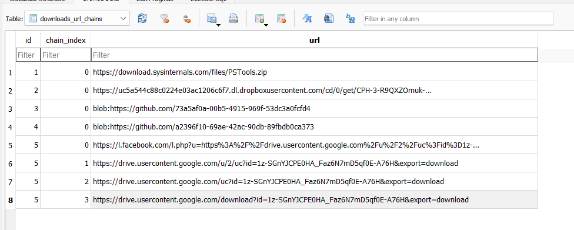
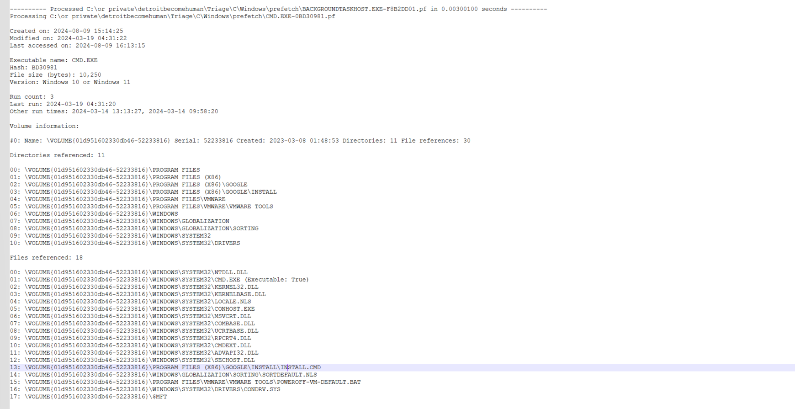

# Detroit becomes Human- hard

### **Sherlock Scenario**

**Alonzo Spire is fascinated by AI after noticing the recent uptick in usage of AI tools to help aid in daily tasks. He came across a sponsored post on social media about an AI tool by Google. The post had a massive reach, and the Page which posted had 200k + followers. Without any second thought, he downloaded the tool provided via the Post. But after installing it he could not find the tool on his system which raised his suspicions. A DFIR analyst was notified of a possible incident on Forela's sysadmin machine. You are tasked to help the analyst in analysis to find the true source of this odd incident.**

resources- triage

relevant info-

edge browser, windows system 

bad link 

starting time 2024-03-19 04:30:00

Analysis

question to ask-

what was the link? 

what did it downloaded?

what happened after? is there more payloads?

what was deleted?

# Tools

- SQLite Browser
- Event Viewer
- PECmd
- RegRipper
- Autopsy
- MFTECmd
- HxD
- Registry Explorer
- PowerShell Logs
- Joe Sandbox

### **Executive Summary**

In this DFIR investigation, we examined the compromised Windows system of Alonzo Spire, who unknowingly installed malware disguised as an AI assistant tool from a social media post. Our analysis focused on uncovering the infection chain, identifying key artifacts, and determining how the malware executed and persisted on the system.

### **Key Findings:**

1. **Initial Infection Source**:
    - Alonzo visited a malicious Facebook post on **2024-03-19 04:30:00** UTC, leading him to download an archive from Google Drive (`AI.Gemini Ultra For PC V1.0.1.rar`).
2. **Malware Installation**:
    - The malware was installed on **2024-03-19 04:31:33** with the version **3.32.3**, masquerading as a legitimate AI tool.
3. **Staging Directory**:
    - The malware was staged in `C:\Program Files (x86)\Google`, leveraging legitimate-looking directories for persistence.
4. **Execution of Malicious Commands**:
    - A PowerShell script (`ru.ps1`) was executed from a command (`install.cmd`) to initiate the malware’s activity, bypassing security policies.
5. **Exfiltration Mechanism**:
    - A small `content.js` file was found in the malware staging directory, containing code likely used for exfiltration via browser extensions or scripts.
6. **User Actions**:
    - Upon failing to find the AI tool, Alonzo searched for it on **2024-03-19 04:32:11**. Realizing the potential compromise, he deleted the file at **2024-03-19 04:34:16**.
7. **Malware Identification**:
    - The MD5 hash of the malicious installer was identified as **BF17D7F8DAC7DF58B37582CEC39E609D**.

### **Conclusion**:

The malware exploited social engineering tactics via a fake AI tool advertisement. It utilized PowerShell for execution and legitimate-looking directories for persistence. The user's prompt actions to delete the file limited further damage. The analysis highlights the importance of cautious software downloads and proactive system monitoring to detect and prevent such compromises.

## Q&A

q1- **What is the full link of a social media post which is part of the malware campaign, and was unknowingly opened by Alonzo spire?**

looking for the web browser - in this case edge and opened it using SQLite

C\Users\alonzo.spire\AppData\Local\Microsoft\Edge\User Data\Default\history

looked on the wrong place , but in history -

a1- [https://www.facebook.com/AI.ultra.new/posts/pfbid0BqpxXypMtY5dWGy2GDfpRD4cQRppdNEC9SSa72FmPVKqik9iWNa2mRkpx9xziAS1l](https://www.facebook.com/AI.ultra.new/posts/pfbid0BqpxXypMtY5dWGy2GDfpRD4cQRppdNEC9SSa72FmPVKqik9iWNa2mRkpx9xziAS1l)

q2- **Can you confirm the timestamp in UTC when alonzo visited this post?**

from  the same history file

a2- 2024-03-19 04:30:00 (converted the time 13355296200136503 using chatgpt)

q3- **Alonzo downloaded a file on the system thinking it was an AI Assistant tool. What is name of the archive file downloaded?**

a3- C:\Users\alonzo.spire\Downloads\AI.Gemini Ultra For PC V1.0.1.rar

found in the same file as history in downloads chart and its fits the description given in the case

q4- **What was the full direct url from where the file was downloaded?**

a4- [https://drive.usercontent.google.com/download?id=1z-SGnYJCPE0HA_Faz6N7mD5qf0E-A76H&export=download](https://drive.usercontent.google.com/download?id=1z-SGnYJCPE0HA_Faz6N7mD5qf0E-A76H&export=download) 

from **download url chain**- in the real url u can see a redirect - for obfuscation  

q5- **Alonzo then proceeded to install the newly download app, thinking that its a legit AI tool. What is the true product version which was installed?**

for this Im moving to event viewer - through application log looked for event id 11707, 1033, 10005, 1035, 11724, 1023 that all relate too creating files in application log and then correlated with the time and saw a log of install the version 3.32.3

q6- **When was the malicious product/package successfully installed on the system?**

a6- 2024-03-19 04:31:33

from the even viewer data

**q7-The malware used a legitimate location to stage its file on the endpoint. Can you find out the Directory path of this location?**

Look for **Event ID 4663** (Object Access) or **Event ID 4688** (Process Creation) which may give clues about where files were created or processes were started.
the security logs don't exist, so lets go over to prefetch files

trying autospy, going in the tracks of missing files are jumping a question

moving to $MFT, its the master file table 
(with MFTcmd.exe of EZ following this command 

MFTECmd.exe -f "C:\or private\detroitbecomehuman\Triage\C\$MFT" --csv "C:\or private\detr
oitbecomehuman" --csvf mftOutput.csv)

looking for install - the mft is where files are written - so there I can locate it

a7-C:\Program Files (x86)\Google

q8-**The malware executed a command from a file. What is name of this file?**

a8- install.cmd

using this [https://www.joesandbox.com/analysis/1356135/1/html#startup](https://www.joesandbox.com/analysis/1356135/1/html#startup) using the process tree, not sure where did I see it before

I think using the prefetch on cmd.exe is a prove of execution  from the prefetch file. moreover when google install is mentioned, and correlation of times 

q9-**What are the contents of the file from question 8? Remove whitespace to avoid format issues.**

a9- @echooff&&powershell-ExecutionPolicyBypass-File"%~dp0nmmhkkegccagdldgiimedpic/ru.ps1"

using autospy preview - from the $mft

q10- **What was the command executed from this file according to the logs?**

a10- powershell -ExecutionPolicy Bypass -File C:\Program Files (x86)\Google\Install\nmmhkkegccagdldgiimedpic/ru.ps1

looking for windows PS logs, and there it is p

q11- **Under malware staging Directory, a js file resides which is very small in size.What is the hex offset for this file on the filesystem?**

a11- 3E90C00

the staging directory is C:\Program Files (x86)\Google, using HxD (tool downloaded)

finding in the MFT that was previously was parsed found content.js file size 258 entry number 64067-

so 64067*1024 = 65604608 (1024 is usually the mft recored size)

then used this website [https://www.rapidtables.com/convert/number/decimal-to-hex.html?x=65604608](https://www.rapidtables.com/convert/number/decimal-to-hex.html?x=65604608) to convert to hex 7 digits - 3E90C00

q12-**Recover the contents of this js file so we can forward this to our RE/MA team for further analysis and understanding of this infection chain. To sanitize the payload, remove whitespaces.**

a12-varisContentScriptExecuted=localStorage.getItem('contentScriptExecuted');if(!isContentScriptExecuted){chrome.runtime.sendMessage({action:'executeFunction'},function(response){localStorage.setItem('contentscriptExecuted',true);});}

open HxD open MFT ( its a small file its probably in the mft recored) → ctrl+g → 3E90C00 

then copied and let chatgpt to convert it from binary 

q13- **Upon seeing no AI Assistant app being run, alonzo tried searching it from file explorer. What keywords did he use to search?**

 uploaded the NTUSER.DAT file to registry explorer looking for WordWhellQuery and found this

this is the location in the registry for search event logs

a13- HKEY_CURRENT_USER\Software\Microsoft\Windows\CurrentVersion\Explorer\WordWheelQuery

q14- **When did alonzo searched it?**

a14-2024-03-19 04:32:11 ( in the latest pic)

q15- **After alonzo could not find any AI tool on the system, he became suspicious, contacted the security team and deleted the downloaded file. When was the file deleted by alonzo?**

a15- 2024-03-19 04:34:16 

used autospy in the recycle bin, to see the date

q16-**Looking back at the starting point of this infection, please find the md5 hash of the malicious installer.**

a16-BF17D7F8DAC7DF58B37582CEC39E609D

needed to be look first thing