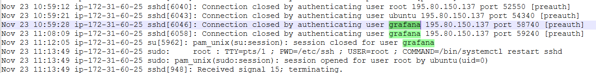

# Ore-

Sherlock Scenario-

**One of our technical partners are currently managing our AWS infrastructure. We requested the deployment of some technology into the cloud. The solution proposed was an EC2 instance hosting the Grafana application. Not too long after the EC2 was deployed the CPU usage ended up sitting at a continuous 98%+ for a process named "xmrig". Important Information Our organisation's office public facing IP is 86.5.206.121, upon the deployment of the application we carried out some basic vulnerability testing and maintenance.**

**TL;DR**
In this challenge, an AWS EC2 instance running Grafana was compromised by exploiting CVE-2021-43798 (a path traversal vulnerability). The attacker gained access, stole credentials, escalated privileges, and deployed the XMRig cryptominer.

Key investigation steps:

Identified the vulnerability exploited for initial access.
Traced attacker actions through log files (auth logs, syslogs) and process analysis.
Detected persistence through a modified cron job running the cryptominer daily.
This walkthrough covers the detailed investigation process, artifacts collected, and how the attack was pieced together.
# Data gathering on the CVE

xmirg - is cryptominer

the only app that was given is grafana, looked for grafana version to determine the cve - its 8.2.0 and the cve that was found

CVE-2021-43798 is a vulnerability in Grafana, an open-source platform for monitoring and observability. This vulnerability allows an unauthenticated user to read files on the server running Grafana, potentially exposing sensitive information. The issue is caused by a directory traversal flaw in the handling of image rendering requests. 

key points to monitor-

1. Monitoring HTTP Request Paths: Look for unusual patterns in request paths, such as
sequences that suggest directory traversal attempts (e.g., ../../ ).
2. Analyzing Access to Sensitive Files: Alerts should be configured for any access attempts to
sensitive files that are outside the normal scope of Grafana's operation, such as system files
or directories.
3. Log Analysis for Suspicious Activity: Utilize log analysis tools to search for patterns of
exploitation, such as unexpected error messages or access patterns that deviate from the
norm.

grep -E '(\.\./)+(\.\./)+' /var/log/grafana/grafana.log (but id dont have the log)

### Walkthrough Summary: EC2 Compromise with XMRig Cryptominer

---

### **Background**

An EC2 instance hosting the **Grafana application** was deployed by our technical partners to monitor the AWS infrastructure. Soon after deployment, the CPU usage spiked to 98% due to a process named **xmrig**, a known cryptominer. Upon investigation, it was confirmed that the instance was compromised, likely exploiting a vulnerability in Grafana.

### **Attack Analysis**

### **Initial Compromise**

- **CVE Exploited**: The attacker exploited **CVE-2021-43798**, a path traversal vulnerability in **Grafana 8.2.0**. This allowed the attacker to read sensitive files such as `/etc/passwd` and configuration files. This vulnerability enables unauthenticated access to files on the server.
1. **Grafana Version**: **8.2.0** (vulnerable to CVE-2021-43798).
2. **Attack Mechanism**: The attacker performed a **Path Traversal** by sending a GET request with `../../../../../etc/passwd`.
3. **IP Addresses Involved**:
    - **95.181.232.32**: Involved in accessing `/etc/passwd` and other sensitive files.
    - **195.80.150.137**: This IP was used to authenticate into Grafana.
    
    
    

---

- **Password Discovered**: The attacker accessed Grafana’s `defaults.ini` configuration file and found hardcoded admin credentials (`f0rela96789!`). Using these credentials, they authenticated into Grafana from IP **195.80.150.137**.
- **Privilege Escalation**: The attacker modified the **`/opt/automation/updater.sh`** file to run the cryptominer as root, giving them elevated privileges.
    
    parsed through a docker of splunk, in order to read through the sysmon event log
    

---

### **Malicious Activities and Cryptomining Setup**

- **Xmrig Process**: The attacker deployed and ran the **xmrig** cryptominer. We found evidence of the process running at `/usr/share/.logstxt/xmrig -c /usr/share/.logstxt/config.json -- threads=0`.
    - The **xmrig** binary and configuration file were initially downloaded to `/opt/automation/` and later moved to **/usr/share/.logstxt/**.
- **Malicious IP Communications**: The xmrig miner communicated with the Monero mining pool at **141.95.126.31:10191**.

---

### **Command and Control**

- **Download Tools**: The attacker used **wget** to download the initial `injector.sh` script, and **curl** to download the cryptomining binary and config file.

- **Persistence Mechanism**: A cron job was scheduled to run the modified script daily at **08:30**, ensuring persistence of the mining operations.

- **Cleanup Attempt**: The attacker used the `shred -u ./injector.sh` command to prevent forensic recovery of the injector script.

---

### **Timeline of Events**

| **Time (UTC)** | **Date** | **Activity** | **Malicious IP** | **Artefact** |
| --- | --- | --- | --- | --- |
| 10:13:32 | 23/11/2022 | GET request to `/login` | 95.181.232.32 | Grafana Access Logs |
| 10:30:55 | 23/11/2022 | GET request to `../../../../../../../etc/passwd` | 95.181.232.32 | Grafana Access Logs |
| 10:51:19 | 23/11/2022 | GET request to Grafana configuration file | 95.181.232.32 | Grafana Access Logs |
| 11:17:18 | 23/11/2022 | Successful SSH login using `grafana` user | 195.80.150.137 | Auth Logs |
| 14:46:00 | 23/11/2022 | `xmrig` binary detected running in `/usr/share/.logstxt` | - | Process and Network Logs |
| 15:01:00 | 24/11/2022 | SOC team began artefact collection | 86.5.206.121 (Office IP) | SOC IP Address Log |

---

### **Artifacts and Malicious Files**:

- **Files Modified**:
    - `/opt/automation/updater.sh`: Modified to escalate privileges and run the mining service as `root`.
- **Binary and Config Files**:
    - **/usr/share/.logstxt/xmrig**: Xmrig binary.
    - **/usr/share/.logstxt/config.json**: Xmrig configuration file.
- **Removed File**:
    - [**injector.sh**](http://injector.sh/): Deleted by the attacker using `shred -u ./injector.sh`.

---

### **Conclusion**

The attacker exploited **CVE-2021-43798** in Grafana 8.2.0, allowing them to perform a path traversal attack and access sensitive files, including the configuration file containing hardcoded credentials. Using these credentials, the attacker escalated privileges, deployed the **xmrig** cryptominer, and set up persistence via a cron job. The SOC team began artefact collection the following day, but the attacker had already deleted some files to cover their tracks.

# Q&A

### Task 1

**Which CVE led to the initial compromise of the EC2?**

- **CVE-2021-43798**

---

### Task 2

**Please detail all malicious IP addresses used by the threat actor (TA) targeting our organization.**

- **44.204.18.94**
- **95.181.232.32**
- **195.80.150.137**

---

### Task 3

**Which account did the TA utilize to authenticate to the host OS?**

- **grafana**

---

### Task 4

**Which file did the TA modify in order to escalate privileges and run the mining service as "root"?**

- **/opt/automation/updater.sh**

---

### Task 5

**Which program did the TA utilize to download the injector.sh script?**

- **wget**

---

### Task 6

**Where was the crypto mining binary & config file initially downloaded to?**

- **/opt/automation/**

---

### Task 7

**Which program did the TA utilize to download both the crypto mining binary & configuration file?**

- **curl**

---

### Task 8

**We need to confirm the exact time the SOC team began artefact collection as this was not included in the report. They utilize the same public-facing IP address as our system administrators in Lincoln.**

- **2022-11-24 15:01:00**

---

### Task 9

**Please confirm the password left by the system administrator in some Grafana configuration files.**

- **f0rela96789!**

---

### Task 10

**What was the mining threads value set to when xmrig was initiated?**

- **0**

---

### Task 11

**Our CISO is requesting additional details surrounding which mining pool this may have been utilizing. Please confirm which (if any) mining pool the TA utilized.**

- **monero.herominers.com**

---

### Task 12

**We couldn't locate the crypto mining binary and configuration file in the original download location. Where did the TA move them to on the file system?**

- **/usr/share/.logstxt/**

---

### Task 13

**We have been unable to forensically recover the "injector.sh" script for analysis. We believe the TA may have run a command to prevent us from recovering the file. What command did the TA run?**

- **shred -u ./injector.sh**

---

### Task 14

**How often does the cronjob created by our IT admins run for the script modified by the TA?**

- **daily - 08:30**
